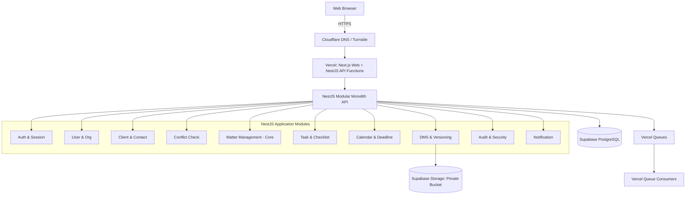

# HỆ THỐNG KIẾN TRÚC TỔNG THỂ (LPMS ARCHITECTURE)

## 1. Phong cách kiến trúc: Modular Monolith
Hệ thống tuân thủ mô hình **Modular Monolith** trong phiên bản V1. Toàn bộ logic nghiệp vụ chạy chung một tiến trình NestJS runtime, nhưng các domain module được phân chia tường minh và giao tiếp với nhau thông qua Service Interfaces rõ ràng:



---

## 2. Monorepo Repository Structure
Tuân thủ cấu trúc phân cấp Monorepo để chia sẻ type và validation schema giữa Frontend và Backend:

```text
lpms/
├── apps/
│   ├── web/                    # Next.js 14+ App Router, Tailwind CSS, TanStack Query
│   └── api/                    # NestJS REST API Server
├── packages/
│   ├── shared/                 # Shared constants, enums, utility functions
│   ├── types/                  # TypeScript interface & types dùng chung
│   ├── config/                 # ESlint, Prettier, TypeScript base configs
│   └── ui/                     # Shared UI components library
├── infrastructure/
│   ├── vercel/                 # Vercel functions, queue và deployment config
│   ├── cloudflare/             # Turnstile, DNS và edge configuration
│   └── scripts/                # Database backup & restore automation scripts
├── docs/
│   ├── architecture/           # Kiến trúc hệ thống và luồng dữ liệu
│   ├── database/               # ERD và lược đồ quan hệ CSDL
│   ├── security/               # Ma trận quyền và chính sách bảo mật
│   ├── api/                    # Quy chuẩn API RESTful
│   └── adr/                    # Architecture Decision Records
├── vercel.json                 # Serverless runtime, queue trigger configuration
├── PROJECT_SPEC.md             # Đặc tả yêu cầu kỹ thuật
└── SECURITY.md                 # Quy tắc an toàn thông tin
```

---

## 3. Phân tầng kiến trúc trong NestJS (API Layering)
Mỗi module bên trong `apps/api/src/modules/` được tổ chức theo 3 tầng chuẩn mực:
1. **Controller Layer:** Tiếp nhận HTTP Request, áp dụng Validation Pipe (Zod/Class-Validator), gọi Guard kiểm tra xác thực (JWT) và ủy quyền (RBAC/Resource Guard), trả về chuẩn Response Envelope.
2. **Service Layer (Domain Logic):** Xử lý nghiệp vụ, kiểm tra tính hợp lệ dữ liệu, kiểm tra Matter Membership, điều phối thao tác nhiều bảng qua transaction, kích hoạt Audit Event và phát sinh thông báo.
3. **Data Access / Repository Layer:** Sử dụng Prisma Client để thao tác với PostgreSQL, quản lý Soft Delete filtering và Pagination query.

---

## 4. Xử lý tác vụ nền (Asynchronous / Background Jobs)
Các tác vụ không cần chặn vòng đời HTTP được chuyển qua **Vercel Queues**. Consumer phải idempotent vì queue có thể giao lại message:
- Gửi email thông báo, email reset mật khẩu.
- Tạo báo cáo tổng hợp, xuất file zip tài liệu.
- Quét định dạng và trích xuất siêu dữ liệu tài liệu.
- Xử lý dọn dẹp các phiên đăng nhập hết hạn hoặc file rác trong recycle bin.

Tác vụ vượt giới hạn serverless hoặc cần tiến trình chạy liên tục không thuộc phạm vi V1; phải được thiết kế thành consumer idempotent hoặc thêm ADR trước khi mở rộng runtime.
