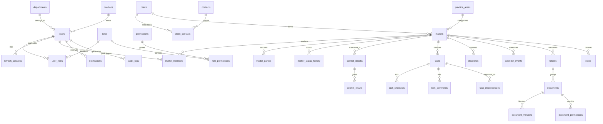

# DATABASE ARCHITECTURE & ENTITY RELATIONSHIP SPECIFICATION (V1)

## 1. Nguyên tắc thiết kế CSDL
1. **Khóa chính & Định danh:** Sử dụng UUIDv4 hoặc CUID cho tất cả các bảng nghiệp vụ. Mã hiển thị cho người dùng (Human-readable code) như `matterCode`, `clientCode`, `employeeCode` phải được áp dụng Unique Constraint cấp database.
2. **Audit & Soft Delete Fields:** Mọi bảng nghiệp vụ cốt lõi đều chứa các trường:
   - `createdAt` (Timestamp with timezone, default now)
   - `createdBy` (UUID, FK -> users.id, nullable khi do hệ thống tạo)
   - `updatedAt` (Timestamp with timezone)
   - `updatedBy` (UUID, FK -> users.id, nullable)
   - `deletedAt` (Timestamp with timezone, nullable)
   - `deletedBy` (UUID, FK -> users.id, nullable)
3. **Tính toàn vẹn tham chiếu:** Khóa ngoại được định nghĩa chặt chẽ với hành vi `ON DELETE RESTRICT` hoặc `SET NULL` đối với dữ liệu pháp lý để tránh mồ côi hoặc mất mát dữ liệu do cascading vô ý.

---

## 2. Danh mục Thực thể CSDL V1 (27 Tables)

---

## 3. Chi tiết các bảng thực thể cốt lõi

### 3.1. Authentication & Authorization
- **`users`**:
  `id` (PK), `email` (Unique), `passwordHash`, `fullName`, `phone`, `status` (`ACTIVE`, `SUSPENDED`, `RESIGNED`), `mfaEnabled`, `mfaSecret`, `failedLoginAttempts`, `lockedUntil`, `departmentId`, `positionId`, `createdAt`, `updatedAt`, `deletedAt`.
- **`roles`**:
  `id` (PK), `name` (`SYSTEM_ADMIN`, `MANAGING_PARTNER`, `PARTNER`, `LAWYER`, `PARALEGAL`, `INTERN`, `ACCOUNTANT`, `ADMIN_STAFF`, `RECEPTIONIST`, `EXTERNAL_COLLABORATOR`), `description`, `isSystem`.
- **`permissions`**:
  `id` (PK), `code` (e.g. `matter.read`, `matter.create`, `document.download`), `module`, `description`.
- **`role_permissions`**: `roleId` (PK), `permissionId` (PK).
- **`user_roles`**: `userId` (PK), `roleId` (PK).
- **`refresh_sessions`**: `id` (PK), `userId` (FK), `tokenHash`, `userAgent`, `ipAddress`, `isRevoked`, `expiresAt`, `createdAt`.

### 3.2. Clients & Contacts
- **`clients`**:
  `id` (PK), `clientCode` (Unique), `type` (`INDIVIDUAL`, `ORGANIZATION`), `displayName`, `taxCode`, `enterpriseNumber`, `status` (`NEW`, `IN_REVIEW`, `CONFLICT_CHECK`, `APPROVED`, `ACTIVE`, `REJECTED`), `email`, `phone`, `address`, `nationality`, `industry`, `notes`, audit fields.
- **`contacts`**:
  `id` (PK), `fullName`, `email`, `phone`, `position`, `idNumber`, `notes`, audit fields.
- **`client_contacts`**: `clientId` (FK), `contactId` (FK), `isPrimary`, `relationship`.
- **`client_relations`**: `sourceClientId` (FK), `targetClientId` (FK), `relationType` (`PARENT`, `SUBSIDIARY`, `SHAREHOLDER`, `DIRECTOR`, `RELATED`).

### 3.3. Matters & Conflict Check
- **`practice_areas`**:
  `id` (PK), `code` (Unique), `name`, `description`, `isActive`.
- **`matters`**:
  `id` (PK), `matterCode` (Unique, format: `MAT-YYYY-000001`), `name`, `description`, `clientId` (FK), `practiceAreaId` (FK), `responsiblePartnerId` (FK -> users), `responsibleLawyerId` (FK -> users), `status` (`INTAKE`, `CONFLICT_CHECK`, `PROPOSAL`, `ACTIVE`, `WAITING_CLIENT`, `WAITING_AUTHORITY`, `ON_HOLD`, `COMPLETED`, `CLOSED`, `ARCHIVED`), `priority` (`LOW`, `NORMAL`, `HIGH`, `URGENT`), `confidentialityLevel` (`NORMAL`, `CONFIDENTIAL`, `HIGHLY_CONFIDENTIAL`, `RESTRICTED`), `openDate`, `expectedCloseDate`, `closeDate`, audit fields.
- **`matter_members`**:
  `id` (PK), `matterId` (FK), `userId` (FK), `roleInMatter` (`RESPONSIBLE_PARTNER`, `RESPONSIBLE_LAWYER`, `MEMBER`, `PARALEGAL_ASSISTANT`, `EXTERNAL`), `canEdit`, `addedAt`, `addedBy`. Unique `(matterId, userId)`.
- **`matter_parties`**:
  `id` (PK), `matterId` (FK), `partyType` (`CLIENT`, `OPPOSING_PARTY`, `RELATED_PARTY`, `AUTHORITY`, `COURT`, `ARBITRATOR`, `WITNESS`, `REPRESENTATIVE`), `name`, `clientId` (FK, nullable), `contactId` (FK, nullable), `details`, audit fields.
- **`matter_status_history`**:
  `id` (PK), `matterId` (FK), `fromStatus`, `toStatus`, `reason`, `changedById` (FK), `createdAt`.
- **`conflict_checks`**:
  `id` (PK), `matterId` (FK, nullable), `clientId` (FK, nullable), `requestedById` (FK), `searchTerms`, `status` (`NO_CONFLICT`, `POTENTIAL_CONFLICT`, `CONFIRMED_CONFLICT`), `decisionNotes`, `reviewedById` (FK, nullable), `reviewedAt`, `createdAt`.
- **`conflict_results`**:
  `id` (PK), `conflictCheckId` (FK), `matchedEntityType`, `matchedEntityId`, `matchedName`, `similarityScore`, `notes`.

### 3.4. Tasks, Deadlines & Calendar
- **`tasks`**:
  `id` (PK), `matterId` (FK), `title`, `description`, `assigneeId` (FK -> users), `reviewerId` (FK -> users), `status` (`TODO`, `IN_PROGRESS`, `WAITING`, `REVIEW`, `COMPLETED`, `CANCELLED`), `priority` (`LOW`, `NORMAL`, `HIGH`, `URGENT`), `startDate`, `dueDate`, `estimatedMinutes`, `actualMinutes`, `completedAt`, `completedById`, audit fields.
- **`task_comments`**: `id` (PK), `taskId` (FK), `userId` (FK), `content`, `createdAt`, `updatedAt`, `deletedAt`.
- **`task_checklists`**: `id` (PK), `taskId` (FK), `title`, `isCompleted`, `position`.
- **`task_dependencies`**: `taskId` (FK), `dependsOnTaskId` (FK).
- **`deadlines`**:
  `id` (PK), `matterId` (FK), `title`, `deadlineType` (`FILING`, `GOVERNMENT`, `COURT`, `CONTRACT_EXPIRY`, `LICENSE_EXPIRY`, `RENEWAL`, `CLIENT`, `INTERNAL`), `dueDate`, `reminderDays` (integer array e.g. `[30, 15, 7, 3, 1]`), `isCompleted`, audit fields.
- **`calendar_events`**:
  `id` (PK), `matterId` (FK, nullable), `title`, `eventType` (`MEETING`, `HEARING`, `APPOINTMENT`, `DEADLINE_EVENT`), `startTime`, `endTime`, `location`, `organizerId` (FK), audit fields.

### 3.5. Document Management System (DMS)
- **`folders`**:
  `id` (PK), `matterId` (FK), `parentId` (FK -> folders, nullable), `name`, `systemFolderType` (nullable), audit fields.
- **`documents`**:
  `id` (PK), `matterId` (FK), `folderId` (FK), `title`, `documentType`, `status` (`DRAFT`, `INTERNAL_REVIEW`, `CLIENT_REVIEW`, `APPROVED`, `SIGNED`, `FINAL`, `ARCHIVED`), `isRestricted`, audit fields.
- **`document_versions`**:
  `id` (PK), `documentId` (FK), `versionNumber` (Int), `storageKey`, `fileSize`, `mimeType`, `fileHash` (SHA-256), `originalFileName`, `comment`, `uploadedById` (FK), `createdAt`.
- **`document_permissions`**:
  `id` (PK), `documentId` (FK), `userId` (FK, nullable), `roleId` (FK, nullable), `permission` (`VIEW`, `DOWNLOAD`, `UPLOAD_VERSION`, `DELETE`).

### 3.6. Notes, Audit & Notifications
- **`notes`**: `id` (PK), `matterId` (FK), `content`, `isRestricted`, audit fields.
- **`notifications`**: `id` (PK), `userId` (FK), `title`, `message`, `type`, `link`, `isRead`, `readAt`, `createdAt`.
- **`audit_logs`**: `id` (PK), `userId` (FK, nullable), `action`, `resourceType`, `resourceId`, `ipAddress`, `userAgent`, `requestId`, `metadata` (JSONB), `createdAt` (Immutable).
- **`system_settings`**: `id` (PK), `key` (Unique), `value` (JSONB), `description`, `updatedAt`, `updatedBy`.
